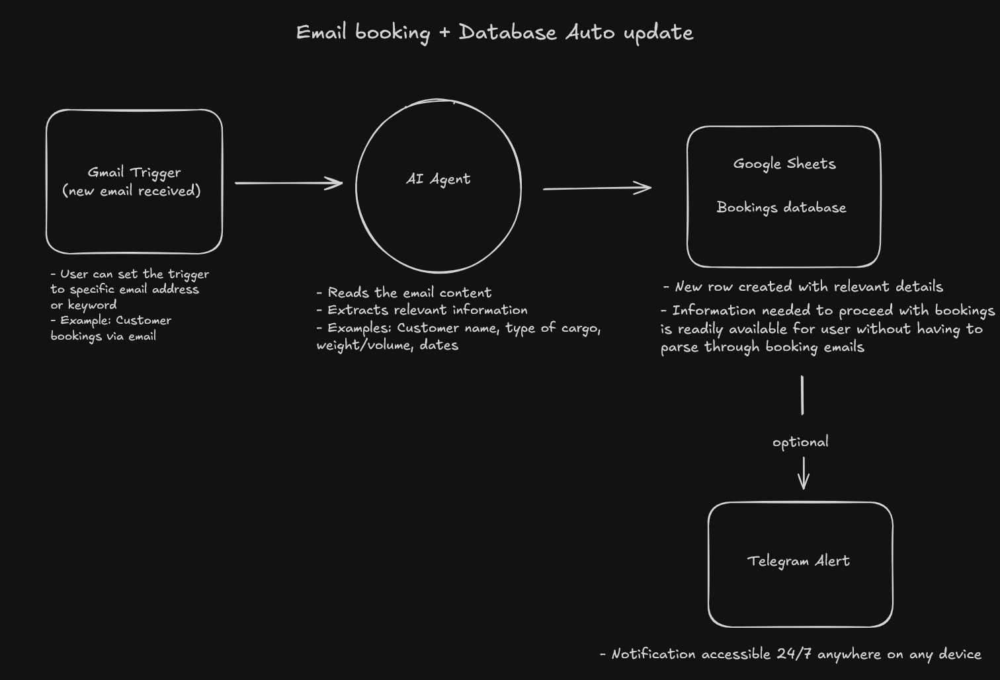
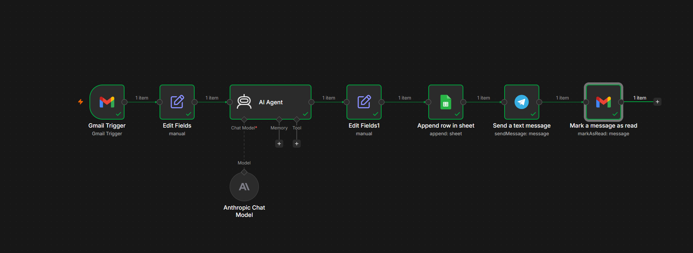
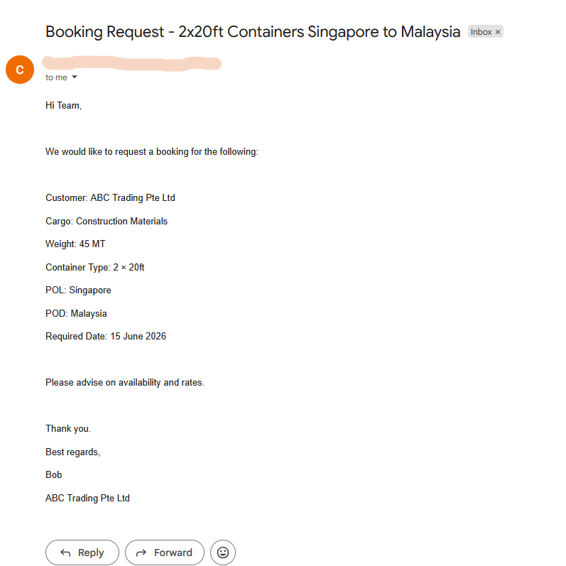
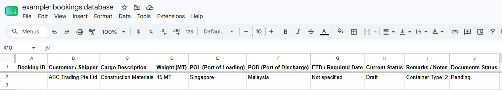
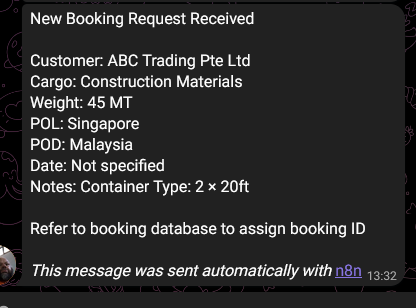

This repository contains images of my n8n workflows and automation projects. These are made from scratch and tested end to end, ready to use, unless stated otherwise. 

Content:

  - Workflow 1: Daily Status + Telegram Alert (Basic Workplace)

  - Workflow 2: Email booking + Database Auto update (Basic Workplace)

## Workflow 1: Daily Status + Telegram Alert

**Description:**  
Agent automatically reads data from Google Sheets and sends a clean daily status report via Telegram.

### Workflow Diagram (Excalidraw)

### n8n Workflow Screenshot

## Workflow 2: Email booking + Database Auto update

**Description:**  
Agent extracts information from specific new emails and fills up the related database automatically while also sending a telegram alert.

### Workflow Diagram (Excalidraw)

### n8n Workflow Screenshot

### screenshots of the email - updated database(google sheets) - telegram alert 

---
