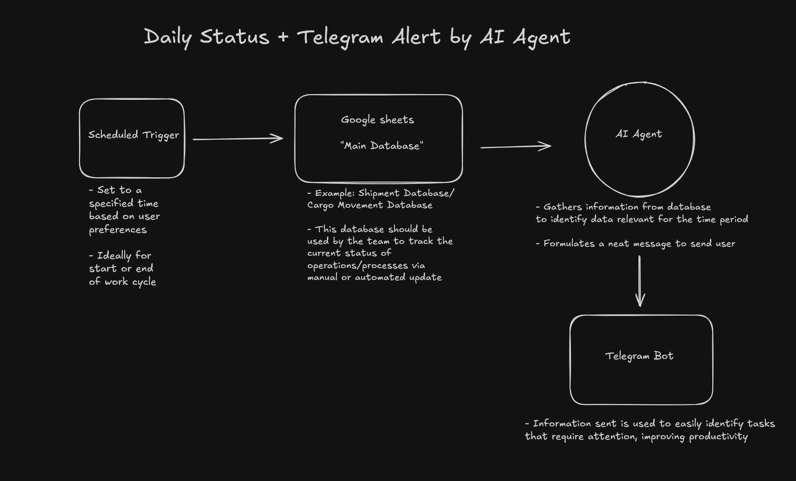
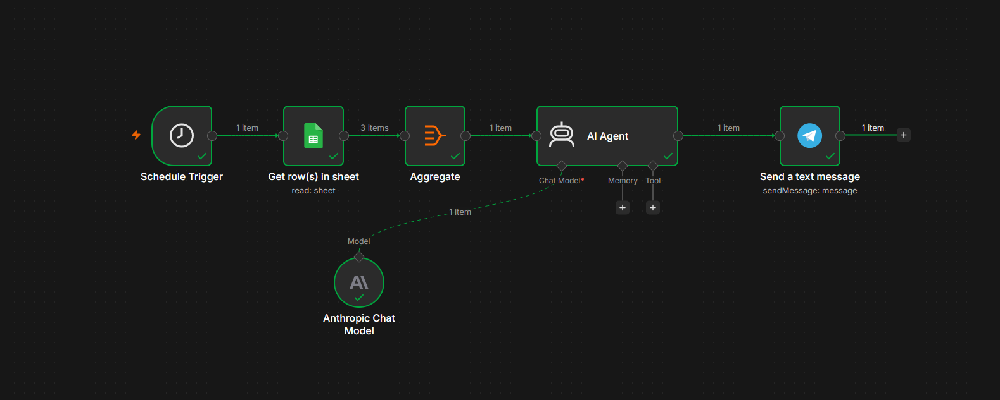

This repository contains my n8n workflows and automation projects.

## Workflow 1: Daily Status + Telegram Alert

**Description:**  
Agent automatically reads data from Google Sheets and sends a clean daily status report via Telegram.

### Workflow Diagram (Excalidraw)

### n8n Workflow Screenshot

## Workflow 2: Email booking + Database Auto update

**Description:**  
Agent extracts information from a new email and fill up the database automatically while also sending a telegram alert.

### Workflow Diagram (Excalidraw)

### n8n Workflow Screenshot

### screenshots of the email - updated database(google sheets) - telegram alert 
(images/
(images/
(images/

---
